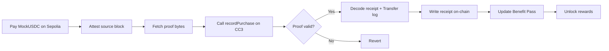

<p align="center">
  
</p>

<p align="center">
  <a href="docs/VOUCH_WHITEPAPER_v1.1.pdf"><strong>Read Whitepaper PDF</strong></a>
</p>

# Vouch

**Turn verified purchases into a loyalty pass that works across merchants.**

Vouch is a cross-chain loyalty app: customers pay merchants in MockUSDC on Ethereum Sepolia, prove their payment through Attestcoin, and earn receipts, stars, levels, and CTC cashback on Creditcoin. Their progress lives in a non-transferable Benefit Pass with artwork generated entirely on-chain.

Payments stay on Sepolia. Rewards and loyalty state live on Creditcoin. No asset bridge is involved.

## Why Vouch?

Loyalty programs usually keep a customer's history inside one merchant's database. Customers start from zero every time they shop somewhere new, while merchants run separate systems to retain the same customers.

At the same time, merchants spend significant marketing budgets trying to generate attention, clicks, and repeat purchases. Vouch explores a more direct model: redirect part of that spend toward customers who actually transact.

With Vouch, purchases are verified through Attestcoin before they contribute to a shared loyalty profile. Verified customers build stars and levels, while merchants can fund CTC rewards through quests and campaigns based on real purchase activity.

A coffee shop can reward repeat Flat White purchases, a bookstore can reward a first purchase, and a ramen shop can run a funded community campaign. Customers carry one loyalty pass across all of them.


This repository is a **testnet hackathon prototype**. Its payment token is an openly mintable MockUSDC, not redeemable USDC; dollar amounts are demo denominations.

## What you can do

- **Shop from merchant menus.** Choose named items with prices and available stock, then pay directly to the merchant's Sepolia address.
- **Prove a payment and earn progress.** Track proof readiness in Activity, claim on Creditcoin, and receive an on-chain receipt and stars. The first verified purchase mints a Benefit Pass.
- **Complete quests.** Make qualifying purchases to earn merchant-funded CTC cashback, with item requirements and level gates.
- **Join community campaigns.** Qualifying purchases advance a shared target; participants can claim rewards once it is reached, subject to available funding.
- **Unlock app cashback.** Higher levels qualify for a percentage of verified spend, paid from a separate CTC treasury.
- **Run a storefront.** The merchant console supports registration, menu and stock management, quests, and funded campaigns.

## Attestcoin Protocol Integration Summary

**Attestcoin supplies the evidence that connects a Sepolia payment to Creditcoin rewards.** The Next.js server fetches proof data; `VouchCore` checks it through Creditcoin's native verifier before applying purchase rewards.


| Integration point | Implementation |
| --- | --- |
| Source network | Ethereum Sepolia, EVM chain ID `11155111`; configured Attestcoin chain key `1` |
| Destination network | Creditcoin CC3 testnet, EVM chain ID `102031` |
| Proof generation | [`POST /api/proof`](app/app/api/proof/route.ts) uses `@gluwa/usc-sdk` `0.18.0` and `proofProvider.service.ProofBuilder.getProof(txHash)` |
| Batch proof | [`POST /api/proof/batch`](app/app/api/proof/batch/route.ts) uses `getBatchProof` (≤10 txs, ≤1000 blocks) with one shared continuity proof; [`VouchCore.recordPurchasesBatch`](contracts/src/VouchCore.sol) verifies once and mints one receipt per payment |
| Attestation waiter | Proof routes resolve the Sepolia chain key at runtime via `get_supported_chains` and optionally long-poll with `waitUntilHeightAttested` (`waitMs`, capped at 25s) before attempting proof retrieval |
| Proof service hosts | `https://proof-gen-api.cc3-testnet.creditcoin.network`, with `https://prover.cc3-testnet.creditcoin.network` as fallback |
| Attestation progress | `chainInfo.PrecompileChainInfoProvider` reads the chain-info precompile at `0x0000000000000000000000000000000000000FD3` |
| On-chain verification | [`VouchCore.recordPurchase`](contracts/src/VouchCore.sol) calls `verifyAndEmit` on `0x0000000000000000000000000000000000000FD2` |
| Proof payload | Source block height, encoded transaction bytes, Merkle proof, and continuity proof |
| Receipt decoding | Vendored [`EvmV1Decoder`](contracts/src/vendor/EvmV1Decoder.sol) decodes transaction fields, receipt status, and ERC-20 event logs |
| Price source network | Ethereum mainnet, EVM chain ID `1`; configured Attestcoin chain key `3` |
| Price pair | Uniswap V2 WCTC (old) / USDT `0x4a4F4fcA1a9B673f9eB23b7EeFe9dFbafd8D8140` (no CTC/USDC V2 pair exists on mainnet) |
| Price proof | [`PriceOracle.pushSyncProof`](contracts/src/PriceOracle.sol) verifies a mainnet swap through the same `0x0FD2` precompile and reads the pair's `Sync` log |

The purchase contract checks that the proof verifies, the receipt succeeded, the transaction targets the configured payment token, and the source transaction sender matches the Creditcoin caller. It then finds a `Transfer` log emitted by that token, from the payer to a registered, active merchant. The reward amount comes from that event, rather than the transaction's native ETH value.

A source transaction can be claimed only once. Its identity is `(chainKey, height, txIndex)`, with the index calculated by the verifier from the Merkle proof. The caller also supplies an item ID and quest IDs; these are application selections, not product information attested by the source payment.

The proof route is stateless and reports `pending`, `ready`, or `error`. It attempts proof retrieval even when the attested height has caught up, because the prover cache may still lag. A server response alone cannot authorize rewards: verification happens in the Creditcoin transaction.

**Additional integration: price observations.** Payments stay on Sepolia (chain key `1`). App cashback is priced from Ethereum mainnet (chain key `3`). [`PriceOracle.pushSyncProof`](contracts/src/PriceOracle.sol) uses the same verifier and decoder to read a Uniswap V2 `Sync(uint112,uint112)` event from the configured pair. It checks receipt success, the emitting pair, increasing source heights, nonzero reserves, and configured rate bounds. App cashback requires that proven rate to be fresh.

There is no CTC/USDC Uniswap V2 pool on mainnet or Sepolia. The configured pair is Uniswap V2 **WCTC (old) / USDT**, which emits `Sync` and quotes a USD stablecoin at 6 decimals. Uniswap V3 WCTC/USDT cannot be used: it does not emit `Sync`.

A live mainnet Sync was proven onto Creditcoin CC3 testnet:

| Step | Evidence |
| --- | --- |
| Source swap (Ethereum) | `0xfdcae0146c9106fe200fd2825671ee5e152a0bf69be5c1df6a1a4a97560a9523`, block `25938627` |
| Attestcoin chain key | `3` (Ethereum), attested at or above that height |
| `0x0FD2.verify` | `true` |
| `pushSyncProof` (Creditcoin) | `0x87f64fafc226a4e25d63e63577efd42a85a40a72a3986fd2f12d80c7cf751705`, status 1 |
| Result | `ctcPerUsd` ≈ 12.998 CTC per $1, `isManual = false` |

Merchant quest and campaign cashback is unchanged: it is funded in CTC and does not use the oracle. Refresh the rate with `pnpm sync:price` after deploying a new oracle.

See [`ATTESTCOIN.md`](ATTESTCOIN.md) for protocol constants, the live price-proof notes, and earlier ETH-payment experiments. The older XP formula and first deployment table in that file describe a prior iteration, not the current MockUSDC flow.

## Progression and cashback

Default purchase rewards are **10 stars per whole demo dollar**, calculated proportionally in the token's six-decimal units with integer rounding. Daily check-ins add stars too, so a level is not exclusively a measure of spending. Merchants configure cashback incentives; protocol-owner settings control purchase-star and level parameters.

| Level | Cumulative stars required | Default app cashback |
| --- | ---: | ---: |
| 1 | 0 | 0% |
| 2 | 50 | 2% |
| 3 | 150 | 4% |
| 4 | 350 | 7% |
| 5 | 700 | 10% |

Quest eligibility and app cashback use the level held **before** the purchase. A purchase that unlocks level 2 receives its app-cashback rate only on subsequent purchases.

Merchant quest rewards, community campaigns, and app cashback have separate accounting. Rewards are credited before users withdraw CTC. App cashback requires a fresh oracle rate and available treasury funds; insufficient funds can produce a partial credit or none.

## Architecture and stack

The frontend uses **Next.js 15, React 19, TypeScript, wagmi, viem, and TanStack Query**. Proof fetching uses the **Gluwa USC SDK and ethers**. Contracts use **Solidity 0.8.28, Foundry, and OpenZeppelin**, targeting the London EVM configuration.

| Contract | Responsibility |
| --- | --- |
| `CommerceRegistry` | Storefront ownership and unique Sepolia payout addresses |
| `Catalog` | Named items, prices, stock, and purchase counters |
| `VouchCore` | Proof verification, receipts, profiles, check-ins, and reward coordination |
| `BenefitPass` | Non-transferable ERC-721 with dynamic on-chain SVG and metadata |
| `QuestManager` | Purchase requirements, level gates, and quest completion |
| `RewardVault` | Merchant quest funding and cashback withdrawals |
| `MilestoneManager` | Community targets, participation, budgets, and claims |
| `PriceOracle` | Proven Uniswap V2 `Sync` reserves from Ethereum mainnet (WCTC/USDT) |
| `AppCashback` | Level-based percentage rewards from the app treasury |
| `StarRedeem` | Surplus stars above the Level 5 line swapped for CTC (100 stars = 10 CTC) |
| `MockUSDC` | Six-decimal Sepolia demo token with an open faucet |

```text
app/app/                 Landing page, customer and merchant consoles
app/app/api/proof/       Server-side Attestcoin proof lookup
app/components/          Wallet flows, purchase modal, pending claims, and UI
app/lib/                 Chain configuration, addresses, ABIs, and contract hooks
contracts/src/           Contracts and vendored Attestcoin interfaces/decoder
contracts/script/        Deployment and demo seeding
contracts/test/          Contract tests and a recorded prover fixture
scripts/                 ABI extraction and a legacy CLI claim helper
```

## Run locally

Prerequisites: a Node.js runtime compatible with Next.js 15 and pnpm 11, **pnpm `11.20.0`** as declared in `package.json`, and **Foundry** for contract builds and tests. Wallet interactions also require an injected browser wallet and testnet gas on both networks.

From the repository root:

```bash
git submodule update --init --recursive
pnpm install
```

The Foundry libraries must be present at `contracts/lib/openzeppelin-contracts` and `contracts/lib/forge-std`. If your checkout lacks `forge-std`, install it before testing:

```bash
cd contracts
forge install foundry-rs/forge-std
cd ..
```

Create `app/.env.local` with the following recorded demo addresses, or substitute the addresses from your own deployment. These are repository-recorded values, not a guarantee of current deployment availability.

```dotenv
NEXT_PUBLIC_COMMERCE_REGISTRY=0x4491522938510A999ad28D145BE3782939D6cd43
NEXT_PUBLIC_BENEFIT_PASS=0xE1f8754bF3E384f2e42c3c7de8bDc73956451434
NEXT_PUBLIC_VOUCH_CORE=0xa208b46d4016D799799591A41500E3f3b44549A0
NEXT_PUBLIC_QUEST_MANAGER=0x19B1aA6eAb81cBC6d742A966633a9F867b31F7D1
NEXT_PUBLIC_REWARD_VAULT=0xD94278AF61cB016CEc7Be98a25E7b0ecf01D61ac
NEXT_PUBLIC_MILESTONE_MANAGER=0xD295ADCce48f68B6b2369521a2eFc6f4260305a4
NEXT_PUBLIC_CATALOG=0x1eb050Db90c64Ca67C2F424414b7C193E7040Bb9
NEXT_PUBLIC_PRICE_ORACLE=0xE705Ee700Cd619e98751ca1D072B87931Ce5e81D
NEXT_PUBLIC_APP_CASHBACK=0x9E7063023e65CD1c593C7d0397C3F7692Af92700
NEXT_PUBLIC_PAYMENT_TOKEN=0xBcb107E49F78C9dBa122eA31137B6ED903F65AeC
NEXT_PUBLIC_STAR_REDEEM=0xfdb448ccf3eb859721192b108e344c386c22501f

# Optional RPC overrides; these match the code's defaults.
NEXT_PUBLIC_CC_RPC=https://rpc.cc3-testnet.creditcoin.network
CREDITCOIN_RPC_URL=https://rpc.cc3-testnet.creditcoin.network
SEPOLIA_RPC_URL=https://ethereum-sepolia-rpc.publicnode.com
```

All ten contract addresses are required by the app's deployment check. `NEXT_PUBLIC_CC_RPC` configures browser Creditcoin reads; the other two RPC variables configure server proof lookup. The browser's Sepolia transport uses wagmi's chain default.

```bash
pnpm dev
```

Open [localhost:3000](http://localhost:3000). For a production build, run `pnpm build`, then `pnpm --filter vouch-app start`.

## Contract development and deployment

```bash
pnpm test
cd contracts
forge build
cd ..
pnpm abis
```

`pnpm abis` regenerates the frontend ABIs from Foundry build artifacts.

For a new deployment, export `PRIVATE_KEY` for a testnet deployer and `PAYMENT_TOKEN` for a six-decimal payment token on Sepolia. The main deploy script does not deploy MockUSDC. Run this from `contracts/` to deploy it separately if needed:

```bash
forge create src/MockUSDC.sol:MockUSDC --rpc-url "$SEPOLIA_RPC_URL" --private-key "$PRIVATE_KEY" --broadcast
```

Set `PAYMENT_TOKEN` to that resulting address. From the repository root, deploy and wire the Creditcoin contracts:

```bash
pnpm deploy --gas-estimate-multiplier 300
```

Before seeding, export the resulting addresses as `COMMERCE_REGISTRY`, `QUEST_MANAGER`, `REWARD_VAULT`, `MILESTONE_MANAGER`, `CATALOG`, `PRICE_ORACLE`, and `APP_CASHBACK`. Set `PAYOUT_COFFEE`, `PAYOUT_BOOKS`, and `PAYOUT_RAMEN` to three distinct Sepolia recipient addresses you intend to use; the script otherwise uses placeholder addresses.

```bash
pnpm seed --gas-estimate-multiplier 300
```

Seeding needs **2012 test CTC plus gas** (merchant campaigns plus a 2000 CTC app-cashback treasury) and is intended for a fresh deployment. After seed, run `pnpm sync:price` so the oracle records a proven mainnet `Sync`. Copy all deployed addresses into the corresponding frontend environment variables, then restart the app. Keep deployment keys in the shell environment, never in `NEXT_PUBLIC_*` variables.

To point an already-seeded `AppCashback` at a new mainnet-keyed oracle without touching merchant vaults:

```bash
APP_CASHBACK=0x… pnpm oracle:mainnet --gas-estimate-multiplier 300
PRICE_ORACLE=<new oracle> pnpm sync:price
```

`StarRedeem` deploys standalone against an existing `VouchCore` — no redeploy or rewiring needed.
From `contracts/`, with `VOUCH_CORE` set to the live core address:

```bash
forge create src/StarRedeem.sol:StarRedeem --rpc-url creditcoin --private-key "$PRIVATE_KEY" \
  --broadcast --constructor-args "$VOUCH_CORE" "$DEPLOYER" --gas-estimate-multiplier 300
```

Then fund its CTC treasury (e.g. `cast send <StarRedeem> --value 100ether ...` or `fund()`), and
set `NEXT_PUBLIC_STAR_REDEEM` to the new address. Until that variable is set, `/redeem` shows
balances with claiming disabled.

The repository's deployment notes record low gas estimates and Foundry receipt-polling issues on CC3. Keep the configured London EVM target and verify deployment and wiring results on-chain if the script reports polling errors.

## Validation and current limits

**92 tests pass across five Foundry suites** in local verification. They cover payment validation, replay rejection, progression, pass rendering, quests, catalog stock, community campaigns, oracle behavior, cashback accounting, batch claims, and star redemption.

The coverage has two distinct layers:

- `Decoder.t.sol` decodes actual recorded Attestcoin bytes from an earlier Sepolia ETH transfer.
- The current MockUSDC purchase and oracle suites use encoded fixtures and a mock verifier to exercise application logic. They do not constitute a live end-to-end test of the current deployment.

Remaining prototype constraints:

- **Administrative controls:** protocol owners can change reward settings and oracle configuration.
- **Inventory timing:** stock is consumed at claim time, not payment time. A stale or sold-out item can leave a verified payment with a receipt and stars but no recorded catalog sale. Item selection does not prove physical fulfillment.
- **Asynchronous infrastructure:** claims depend on source attestation, prover availability, and RPC access. Pending-payment tracking is stored in browser `localStorage`.
- **Scale:** the UI enumerates contract records without a dedicated indexer.
- **Legacy CLI:** `scripts/claim.mjs` submits the current claim arguments, but its final profile formatter still expects old ETH/XP fields and can fail after submission. Use the browser claim flow for the current demo.

Useful next steps are a recorded live MockUSDC proof-to-reward demonstration, better pending-payment recovery, and an inventory reservation strategy.
